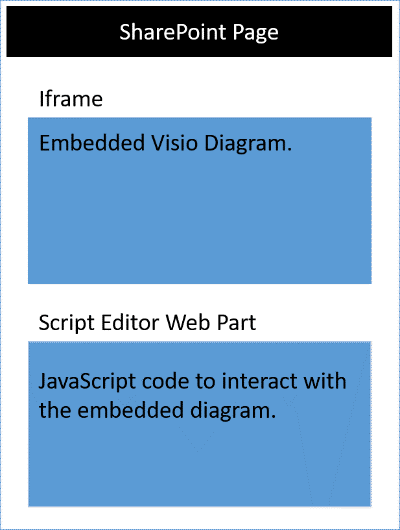
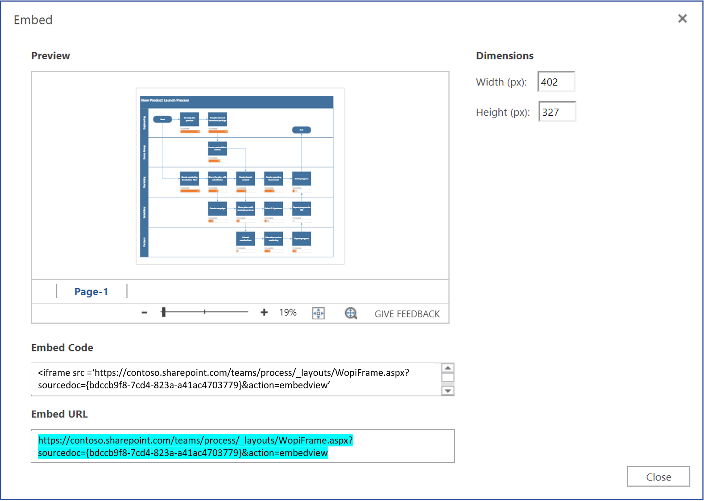

# <a name="visio-javascript-api-overview"></a>Visio-JavaScript-API (Übersicht)

Sie können die JavaScript-APIs für Visio zum Einbetten von Visio-Diagrammen in SharePoint Online verwenden. Ein eingebettetes Visio-Diagramm ist ein Diagramm, das in einer SharePoint-Dokumentbibliothek gespeichert und auf einer SharePoint-Seite angezeigt wird. Wenn Sie ein Visio-Diagramm einbetten, anzeigen in einer HTML `<iframe>` Element. Anschließend können Sie die JavaScript-APIs für Visio verwenden, um programmgesteuert mit dem eingebetteten Diagramm zu arbeiten.




Sie können die Visio-JavaScript-APIs für Folgendes verwenden:

* Interagieren Sie mit Visio-Diagrammelemente wie Seiten und Shapes.
* Erstellen von Markup mit visual auf Visio-Diagramm Zeichenbereichs ab.
* Schreiben von benutzerdefinierten Handlern für Mausereignisse innerhalb der Zeichnung.
* Verfügbarmachen von Diagrammdaten, z. B. Shapetext, Shapedaten und Hyperlinks in Ihrer Lösung

In diesem Artikel wird beschrieben, wie die JavaScript-APIs für Visio mit Visio Online zum Erstellen von Lösungen für SharePoint Online verwendet werden. Der Artikel enthält eine Einführung in die wichtigsten Konzepte zur Verwendung der APIs, wie z. B. **EmbeddedContext**, **RequestContext** sowie zu JavaScript-Proxyobjekten und den **sync()**-, **Visio.run()**- und **load()**-Methoden. In den Codebeispielen wird gezeigt, wie Sie diese Konzepte anwenden.

## <a name="embeddedsession"></a>EmbeddedSession

Das EmbeddedSession-Objekt initialisiert die Kommunikation zwischen dem Entwickler- und dem Visio Online-Frame.

```js
var session = new OfficeExtension.EmbeddedSession(url, { id: "embed-iframe",container: document.getElementById("iframeHost") });
session.init().then(function () {    
    window.console.log("Session successfully initialized");
});
```

## <a name="visiorunsession-functioncontext--batch-"></a>Visio.Run (Sitzung function(context) {Batch})

**Visio.run()** führt ein Batch-Skript aus, das Aktionen zum Visio-Objektmodell durchführt. Die Batchbefehle enthalten Definitionen lokaler JavaScript-Proxyobjekte und **sync()**-Methoden, die den Status zwischen den lokalen und Visio-Objekten und der Zusage-Auflösung synchronisieren. Der Vorteil von Batch-Anforderungen in **Visio.run()** ist, dass bei der Zusage-Auflösung aller nachverfolgten Bereichsobjekte, die während der Ausführung zugeordnet wurden, automatisch freigegeben werden. 

Die run-Methode ist in der Sitzung und RequestContext-Objekt und gibt eine Zusage zurück (nur in der Regel das Ergebnis der **context.sync()**). Es ist möglich, den Batchvorgang außerhalb der **Visio.run()** auszuführen. In einem solchen Szenario müssen die Seitenobjektverweise jedoch manuell nachverfolgt und verwaltet werden. 

## <a name="requestcontext"></a>RequestContext

Das Objekt RequestContext vereinfacht die Anforderungen an die Visio-Anwendung. Da der Rahmen für Entwickler und die Visio-Online-Anwendung in zwei verschiedenen Iframes ausführen, ist das RequestContext-Objekt (Kontext im folgenden Beispiel) erforderlich, um Zugriff auf Visio und damit zusammenhängende Objekte wie Seiten und -Shapes aus der Rahmen für Entwickler zu erhalten. 

```js
function hideToolbars() {
    Visio.run(session, function(context){
        var app = context.document.application;
        app.showToolbars = false;            
        return context.sync().then(function ()
        {
            window.console.log("Toolbars Hidden");
        });      
        }).catch(function(error)
    {
        window.console.log("Error: " + error);            
    });
};
```

## <a name="proxy-objects"></a>Proxyobjekte

Die in einem Add-In deklarierten und verwendeten Visio-JavaScript-Objekte sind Proxyobjekte für die realen Objekte in einem Visio-Dokument. Alle Aktionen zu Proxyobjekten werden in Visio nicht realisiert, und der Status des Visio-Dokuments wird in den Proxyobjekten erst umgesetzt, wenn der Status des Dokuments synchronisiert wurde. Der Dokumentstatus wird synchronisiert, wenn `context.sync()` ausgeführt wird.

Verweisen auf die ausgewählte Seite ist beispielsweise lokale JavaScript-Objekt GetActivePage deklariert. Dies kann die Einstellung der Eigenschaften und Methoden aufrufen in die Warteschlange verwendet werden. Die Aktionen für solche Objekte werden nicht realisiert, bis die **sync()** -Methode ausgeführt wird.

```js
var activePage = context.document.getActivePage();
```

## <a name="sync"></a>sync()

Die **sync()** -Methode den Status zwischen JavaScript Proxyobjekte synchronisiert und reale Objekte in Visio durch Ausführen von Anweisungen in der Warteschlange auf dem Kontext und Abrufen von Eigenschaften des Office-Objekte für die Verwendung in Ihrem Code geladen. Diese Methode gibt eine Zusage zurück, die nach Abschluss der Synchronisierung aufgelöst wird. 

## <a name="load"></a>load()

Die **load()**-Methode dient zum Auffüllen der Proxyobjekte, die auf der JavaScript-Ebene im Add-In erstellt werden. Beim Abrufen eines Objekts, z. B. eines Dokuments, wird ein lokales Proxyobjekt zunächst auf der JavaScript-Ebene erstellt. Damit kann die Einstellung der Eigenschaften und das Abrufen von Methoden in der Warteschlange verwendet werden. Zum Lesen von Objekteigenschaften oder Beziehungen müssen die **load()**- und **sync()**-Methoden zuerst aufgerufen werden. Die load()-Methode nimmt die Eigenschaften und Beziehungen auf, die beim Aufrufen der **sync()**-Methode geladen werden müssen.

Nachfolgend ist die Syntax für die **load()**-Methode veranschaulicht.

```js
object.load(string: properties); //or object.load(array: properties); //or object.load({loadOption});
```

1. **Eigenschaften** ist die Liste der Eigenschaftennamen geladen, als angegebenen durch Trennzeichen getrennte Zeichenfolgen sein oder Array von Namen. Weitere Informationen dazu finden Sie in den **.load()**-Methoden unter den einzelnen Objekten.

2. **loadOption** gibt ein Objekt an, das die Optionen für Auswahl, Erweiterung, oben und Überspringen beschreibt. Weitere Informationen finden Sie im Objekt [Ladeoptionen](/javascript/api/office/officeextension.loadoption).

## <a name="example-printing-all-shapes-text-in-active-page"></a>Beispiel: Drucken des gesamten Shapetexts in der aktiven Seite

Das folgende Beispiel zeigt, wie der Shapetextwert aus einem Arrayshapeobjekt gedruckt wird. Die **Visio.run()**-Methode enthält eine Reihe von Anweisungen. Als Teil dieses Batches wird ein Proxyobjekt erstellt, das auf Shapes im aktiven Dokument verweist.

Alle diese Befehle werden in die Warteschlange gestellt und ausgeführt werden, wenn **context.sync()** aufgerufen wird. Die**sync()**-Methode gibt eine Zusage zurück, mit der sie mit anderen Vorgängen verkettet werden kann.

```js
Visio.run(session, function (context) {
   var page = context.document.getActivePage();
   var shapes = page.shapes;
   shapes.load();
   return context.sync().then(function () {
        for(var i=0; i<shapes.items.length;i++)
 {
            var shape = shapes.items[i];
     window.console.log("Shape Text: " + shape.text );
 }
});
}).catch(function(error) {
  window.console.log("Error: " + error);
  if (error instanceof OfficeExtension.Error) {
       window.console.log ("Debug info: " + JSON.stringify(error.debugInfo));
  }
});
```

## <a name="error-messages"></a>Fehlermeldungen

Fehler werden mithilfe eines Fehlerobjekts zurückgegeben, das aus einem Code und einer Nachricht besteht. Die folgende Tabelle enthält eine Liste möglicher Fehlerzustände, die auftreten können.

| error.code            | error.message |
|-----------------------|----------------------------------------------------------------|
| InvalidArgument       | Das Argument ist ungültig oder fehlt oder weist ein falsches Format auf. |
| GeneralException      | Beim Verarbeiten der Anforderung ist ein interner Fehler aufgetreten. |
| NotImplemented        | Das angeforderte Feature ist nicht implementiert.  |
| UnsupportedOperation  | Dieser Vorgang wird nicht unterstützt. |
| AccessDenied          | Sie können den angeforderten Vorgang nicht durchzuführen. |
| ItemNotFound          | Die angeforderte Ressource ist nicht vorhanden. |

## <a name="get-started"></a>Erste Schritte

Das Beispiel können in diesem Abschnitt Sie die ersten Schritte beim. Dieses Beispiel zeigt, wie den Shape-Text des ausgewählten Shapes in einem Visio-Diagramm programmgesteuert angezeigt. Zunächst erstellen Sie eine klassische Seite in SharePoint Online, oder bearbeiten Sie eine vorhandene Seite. Fügen Sie ein Skript-Editor-Webpart auf der Seite und den folgenden Code kopieren und einfügen.

```js
<script src='https://appsforoffice.microsoft.com/embedded/1.0/visio-web-embedded.js' type='text/javascript'></script>

Enter Visio File Url:<br/>
<script language="javascript">
document.write("<input type='text' id='fileUrl' size='120'/>");
document.write("<input type='button' value='InitEmbeddedFrame' onclick='initEmbeddedFrame()' />");
document.write("<br />");
document.write("<input type='button' value='SelectedShapeText' onclick='getSelectedShapeText()' />");
document.write("<textarea id='ResultOutput' style='width:350px;height:60px'> </textarea>");
document.write("<div id='iframeHost' />");

let session; // Global variable to store the session and pass it afterwards in Visio.run()
var textArea;
// Loads the Visio application and Initializes communication between devloper frame and Visio online frame
function initEmbeddedFrame() {
        textArea = document.getElementById('ResultOutput');
    var url = document.getElementById('fileUrl').value;
    if (!url) {
        window.alert("File URL should not be empty");
    }
    // APIs are enabled for EmbedView action only.   
    url = url.replace("action=view","action=embedview");
    url = url.replace("action=interactivepreview","action=embedview");
    url = url.replace("action=default","action=embedview");
    url = url.replace("action=edit","action=embedview");
  
       session = new OfficeExtension.EmbeddedSession(url, { id: "embed-iframe",container: document.getElementById("iframeHost") });
       return session.init().then(function () {
        // Initilization is successful 
        textArea.value  = "Initilization is successful";
    });
     }

// Code for getting selected Shape Text using the shapes collection object
function getSelectedShapeText() {
    Visio.run(session, function (context) {     
       var page = context.document.getActivePage();
       var shapes = page.shapes;
       shapes.load();
           return context.sync().then(function () {
               textArea.value = "Please select a Shape in the Diagram";
               for(var i=0; i<shapes.items.length;i++)
            {
              var shape = shapes.items[i];
                  if ( shape.select == true)
               {
                textArea.value = shape.text;
                    return;
                   }
            }
      });
     }).catch(function(error) {
        textArea.value = "Error: ";
        if (error instanceof OfficeExtension.Error) {
            textArea.value += "Debug info: " + JSON.stringify(error.debugInfo);
        }
    });
}
</script>
```

Nach Ausführung dieses brauchen Sie ist die URL eines Visio-Diagramms, dem Sie arbeiten möchten. Gerade Laden Sie das Visio-Diagramm in SharePoint Online, und öffnen Sie es in Visio Online. Öffnen Sie von dort das Dialogfeld "einbetten", und verwenden Sie die URL einbetten im obigen Beispiel.



Wenn Sie Online Visio im Bearbeitungsmodus verwenden, öffnen Sie im Dialogfeld einbetten durch Auswählen von **Datei** > **Freigeben** > **einbetten**. Wenn Sie Online Visio im Ansichtsmodus verwenden, öffnen Sie im Dialogfeld einbetten durch Auswählen von '...' und klicken Sie dann auf **einbetten**. 

## <a name="open-api-specifications"></a>Offene API-Spezifikationen

Während des Entwerfens und Entwickelns neuer APIs stellen wir diese zur Verfügung, damit Sie auf der Seite [Offene API-Spezifikationen](../openspec.md) Ihr Feedback abgeben können. Erfahren Sie, welche neuen Funktionen geplant sind, und teilen Sie uns Ihre Meinung zu unseren Designspezifikationen mit. 

## <a name="visio-javascript-api-reference"></a>Visio-JavaScript-API-Referenz

Ausführliche Informationen zu Visio-JavaScript-API finden Sie in der [Visio-JavaScript-API-Referenzdokumentation](/javascript/api/visio).
